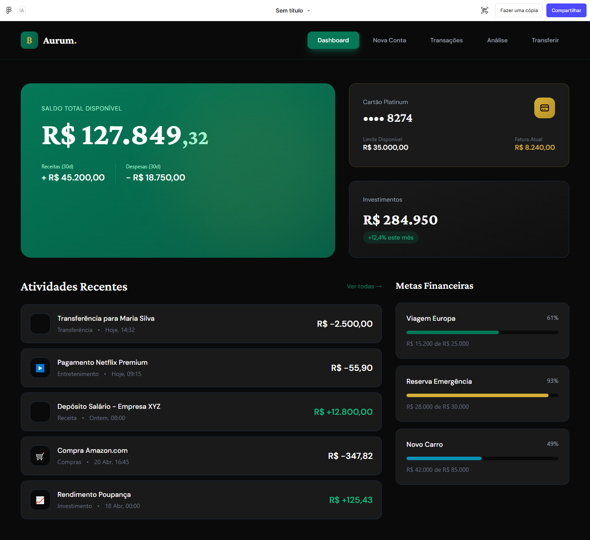

# ₿ Aurum - Dashboard Financeiro

Uma interface de dashboard financeiro moderna, elegante e responsiva desenvolvida para a fintech **Aurum**. O projeto apresenta uma visão consolidada de saldo, controle de receitas/despesas, faturas de cartão de crédito, investimentos e acompanhamento de metas financeiras.

Projeto desenvolvido como parte das atividades da **FIAP**.

## 🚀 Demonstração

O projeto está publicado e pode ser visualizado online através do GitHub Pages:
🔗 [Acesse o Projeto Ao Vivo](https://cassiano022.github.io/projeto-Fintech-Fiap/)

---

## 📸 Interface do Projeto

Abaixo está a demonstração visual da interface desenvolvida (conforme o arquivo de design `01.png`):

<div align="center">
  
</div>

---

## 🛠️ Funcionalidades da Tela

- **Visão Geral de Saldo:** Card principal com destaque para o saldo disponível, além de um resumo de receitas e despesas dos últimos 30 dias.
- **Gerenciamento de Cartão:** Exibição do limite disponível e valor da fatura atual do cartão Platinum.
- **Acompanhamento de Investimentos:** Painel com o valor total investido e a porcentagem de rendimento mensal.
- **Atividades Recentes:** Histórico detalhado das últimas transações financeiras (transferências, depósitos, compras e rendimentos), com ícones indicativos e diferenciação de valores positivos/negativos.
- **Metas Financeiras:** Barras de progresso visuais para acompanhar a evolução de objetivos pessoais, como Viagem para a Europa, Reserva de Emergência e Novo Carro.

---

## 💻 Tecnologias Utilizadas

O projeto foi construído utilizando tecnologias web fundamentais, focando em semântica, organização e performance:

*   **HTML5:** Estruturação semântica de todo o layout do dashboard.
*   **CSS3:** Estilização baseada em um tema escuro (*dark mode*), utilizando **CSS Grid** e **Flexbox** para o alinhamento preciso dos componentes.
*   **Google Fonts:** Utilização da fonte moderna e legível *Inter*.

---

## 📁 Estrutura de Arquivos

```text
projeto-Fintech-Fiap/
├── 01.png          # Imagem de referência do design
├── index.html      # Estrutura semântica da aplicação
└── styles.css      # Estilização completa e layout (Grid/Flexbox)
